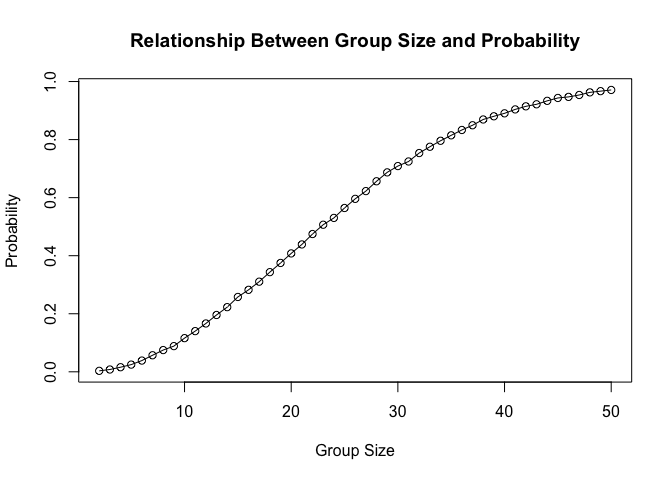
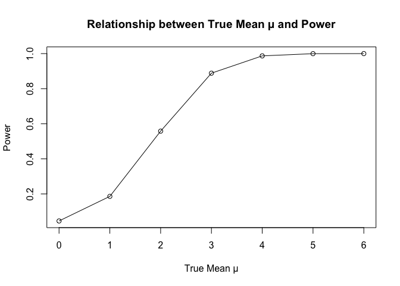
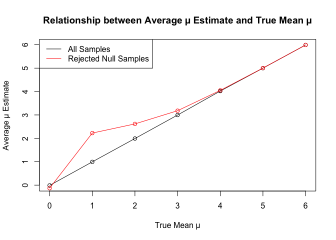
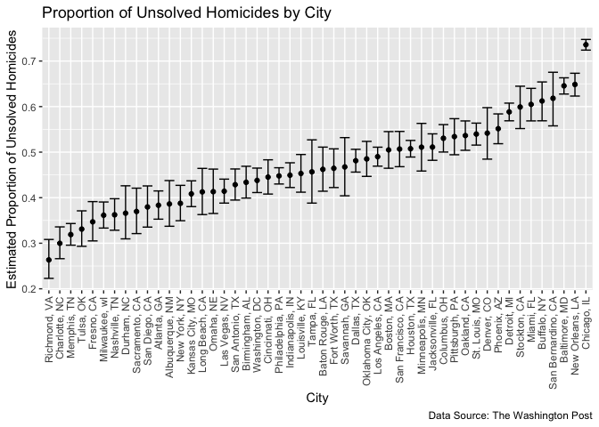

p8105_hw5_cr3442
================
Cheng
2024-11-15

``` r
library(dplyr)
```

    ## 
    ## Attaching package: 'dplyr'

    ## The following objects are masked from 'package:stats':
    ## 
    ##     filter, lag

    ## The following objects are masked from 'package:base':
    ## 
    ##     intersect, setdiff, setequal, union

``` r
library(tidyr)
library(purrr)
library(broom)
library(ggplot2)
library(readr) 
library(stringr)
library(forcats)
library(magrittr)
```

    ## 
    ## Attaching package: 'magrittr'

    ## The following object is masked from 'package:purrr':
    ## 
    ##     set_names

    ## The following object is masked from 'package:tidyr':
    ## 
    ##     extract

## Problem 1

  
First simulate random birthdays and check for duplicate birthdays.  

``` r
# Simulate random birthdays and check for duplicates
birthday_simulation <- function(n) {
  birthdays <- sample(1:365, n, replace = TRUE)
  return(any(duplicated(birthdays)))
}
```

  
Then use functions to simulate the probability that at least two people
in multiple groups have the same birthday.  

``` r
set.seed(123) # Ensure reproducibility
group_sizes <- 2:50
results <- sapply(group_sizes, function(n) {
  mean(replicate(10000, birthday_simulation(n)))
})
```

  
At last we output image.  

``` r
# Plot the probability as a function of group size
plot(group_sizes, results, type = "o", xlab = "Group Size", ylab = "Probability",
     main = "Relationship Between Group Size and Probability")
```

<!-- -->  
\### Comments:  
The probability curve in the figure shows an S-shaped growth trend,
which means that when the group size is increased, the probability
increases slowly at first, then increases rapidly, and then levels off.
The probability exceeds 0.5 when the group size reaches about 23 people.
This means that with 23 people, the probability that at least two people
share the same birthday is more than 50%.

## Problem 2

  
first power analysis through simulation.  

``` r
# Define the power simulation function
power_analysis <- function(mu, n = 30, sigma = 5, alpha = 0.05) {
  p_values <- replicate(5000, {
    data <- rnorm(n, mean = mu, sd = sigma)
    t_result <- tidy(t.test(data, mu = 0))
    t_result$p.value
  })
  power <- mean(p_values < alpha)
  return(power)
}

true_mus <- 0:6
power_results <- sapply(true_mus, power_analysis)
```

  
Then output image.  

``` r
# Plot the power curve
plot(true_mus, power_results, type = "o", xlab = "True Mean µ", ylab = "Power",
     main = "Relationship between True Mean µ and Power")
```

<!-- -->  
\### Comments  
As μ increases, the power increases and approaches 1 when μ is greater
than or equal to 4, indicating that the null hypothesis is almost always
correctly rejected. This means that increasing the effect size when we
design an experiment can effectively increase power, that is, increase
the probability of rejecting the null hypothesis in the corresponding
test.  
Then generate simulation results for mean estimation, compute the
average estimated mean for each true mean, and compute the average
estimated mean for the rejection of the null hypothesis.  

``` r
mu_estimates <- lapply(true_mus, function(mu) {
  replicate(5000, {
    data <- rnorm(30, mean = mu, sd = 5)
    t_result <- tidy(t.test(data, mu = 0))
    list(mu_hat = mean(data), p_value = t_result$p.value)
  }, simplify = FALSE)
})
# Compute the average estimated mean under each true mean
avg_mu_hat <- sapply(mu_estimates, function(sim_list) {
  mean(sapply(sim_list, function(x) x$mu_hat))
})

# Calculates the average estimated mean when the null was rejected 
avg_mu_hat_rejected <- sapply(mu_estimates, function(sim_list) {
# Filter out samples that reject the null
  rejected_samples <- Filter(function(x) x$p_value < 0.05, sim_list)
  if (length(rejected_samples) > 0) {
    mean(sapply(rejected_samples, function(x) x$mu_hat))
  } else {
    NA
  }
})
```

  
Finally we can plot the estimates.  

``` r
plot(true_mus, avg_mu_hat, type = "o", xlab = "True Mean µ", ylab = "Average µ Estimate",
     main = "Relationship between Average µ Estimate and True Mean µ")
lines(true_mus, avg_mu_hat_rejected, type = "o", col = "red")
legend("topleft", legend = c("All Samples", "Rejected Null Samples"), col = c("black", "red"), lty = 1)
```

<!-- -->  
\### Comments:  
The average μ̂ increases as the true mean μ increases, and is
approximately linearly related to μ, that is, in each simulation, the
estimated mean should be close to the true mean. For samples that reject
the null hypothesis, the average μ̂ is usually larger than the μ̂ in the
overall sample, which means that when the power is high, the estimated
value tends to be far away from the null hypothesis.  
The sample average of μ̂ across tests for which the null is rejected does
not approximately equal to the true value of μ. In the sample, the data
used only when the null hypothesis is rejected has a selection bias,
which causes the average μ̂ of these samples to be higher than the true
μ. This means that in a conditional selection sample (that is, only
those samples with significant p values are selected), the estimated
value will be significantly higher than the overall mean.

## Problem 3

  
First read in the data.

``` r
# Read and clean the raw data
homicide_df = 
  read_csv("data/homicide-data.csv")%>% 
  mutate(
    city_state = str_c(city, state, sep = ", "),
    resolved = case_when(
      disposition == "Closed without arrest" ~ "unsolved",
      disposition == "Open/No arrest"        ~ "unsolved",
      disposition == "Closed by arrest"      ~ "solved"
    )
  ) %>% 
  select(city_state, resolved) %>% 
  filter(city_state != "Tulsa, AL")
```

    ## Rows: 52179 Columns: 12
    ## ── Column specification ────────────────────────────────────────────────────────
    ## Delimiter: ","
    ## chr (9): uid, victim_last, victim_first, victim_race, victim_age, victim_sex...
    ## dbl (3): reported_date, lat, lon
    ## 
    ## ℹ Use `spec()` to retrieve the full column specification for this data.
    ## ℹ Specify the column types or set `show_col_types = FALSE` to quiet this message.

  
Then summarize the total number of unsolved cases in each of the
cities.  

``` r
aggregate_df = 
  homicide_df %>% 
  group_by(city_state) %>% 
  summarize(
    hom_total = n(),
    hom_unsolved = sum(resolved == "unsolved")
  )
```

  
Then do a prop test for Baltimore, MD.  

``` r
prop.test(
  aggregate_df %>% filter(city_state == "Baltimore, MD") %>% pull(hom_unsolved), 
  aggregate_df %>% filter(city_state == "Baltimore, MD") %>% pull(hom_total)) %>% 
  broom::tidy()
```

    ## # A tibble: 1 × 8
    ##   estimate statistic  p.value parameter conf.low conf.high method    alternative
    ##      <dbl>     <dbl>    <dbl>     <int>    <dbl>     <dbl> <chr>     <chr>      
    ## 1    0.646      239. 6.46e-54         1    0.628     0.663 1-sample… two.sided

  
Next run prop.test for each of the cities in the dataset.  

``` r
results_df = 
  aggregate_df %>% 
  mutate(
    prop_tests = map2(.x = hom_unsolved, .y = hom_total, ~prop.test(x = .x, n = .y)),
    tidy_tests = map(prop_tests, broom::tidy)
  ) %>% 
  
# Extract both the proportion of unsolved homicides and the confidence interval for each
  unnest(tidy_tests) %>% 
  select(city_state, estimate, conf.low, conf.high)
```

  
Finally we can create a plot that shows the estimates and CIs for each
city.  

``` r
results_df %>% 
  mutate(city_state = fct_reorder(city_state, estimate)) %>% 
  ggplot(aes(x = city_state, y = estimate)) +
  geom_point() + 
  geom_errorbar(aes(ymin = conf.low, ymax = conf.high)) + 
  theme(axis.text.x = element_text(angle = 90, vjust = 0.5, hjust = 1)) +
  labs(
    title = "Proportion of Unsolved Homicides by City",
    x = "City",
    y = "Estimated Proportion of Unsolved Homicides",
    caption = "Data Source: The Washington Post"
  )
```

<!-- -->
